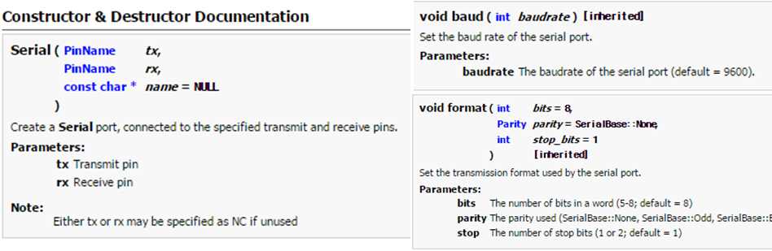
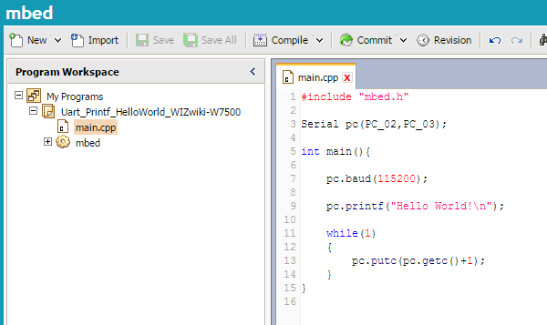
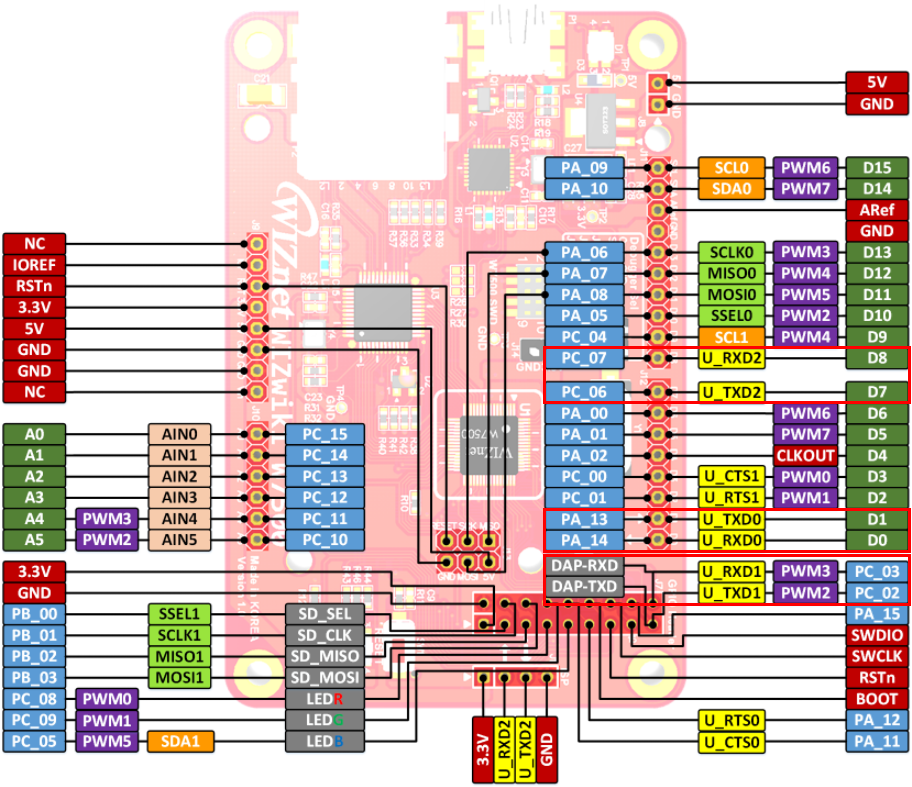
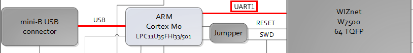

# UART
>This example is a program that connects PC and Wizwiki W7500 using UART communication. If charcter data is input from PC to Wizwiki W7500, character data + 1 is output as PC. A more detailed data flow is as follows.

    1) WIZwiki W7500 outputs "Hello World" to PC Serial terminal.
    2) Input character data to PC Serial terminal.
    3) Input character data is transmitted to WIZwiki W7500 via UART communication.
    4) WIZwiki W7500 increases the input character data value by 1. (character data value: ASCII Code Value, 'a'= 97, 'b' = 98)
    5) WIZwiki W7500 outputs the character data corresponding to the increased character data value to the PC Serial terminal using UART communication.
    

### 1. Importing UART Example
This is the 'UART Example' program. Enter the 'Import into Compiler' Linked button.

> The Mbed library supports the following class references for UART communication. For more information, see the links below.

  

## [Mbed library link](https://developer.mbed.org/users/mbed_official/code/mbed/docs/tip/classmbed_1_1Serial.html)

> Let's open the main.cpp file in Program Workspace. This program used "Serial" class provided by the mbed library for UART communication. This program using 'PC_2' and 'PC_3' for UART comunication. Serial baudrate is 115200 (Set baudrate value).

~~~cpp
#include "mbed.h"

//Generate pc Object from Serial Library
//Serial(/*TXD*/,/*RXD*/);
Serial pc(PC_02,PC_03);

int main(){

    pc.baud(115200); //Call baud() to set Baudrate

    pc.printf("Hello World!\n");

    while(1)
    {        
        pc.putc(pc.getc()+1); //Output the input value + '1'
    }
}

~~~

### 2. Hardware Wiring
> #### Component
>  * WIZwiki-W7500
>  * Serial Terminal (Hercules)

> #### WIZwiki-W7500
> * WIZwiki W7500 supports UART0, UART1 and UART2.
> * Since UART1 of WIZwiki W7500 is connected to the USB port, it can be used as a USB port.

### 3. Result
> Serial Terminal input (Hercules)
>   * Upload the program to Wizwiki W7500.
>   * Make sure that Port name and Baudrate are correctly set and connect the WIZwiki W7500 and PC. (Using Serial Terminal)
>   * After pressing the reset button of Wizwiki W7500, "Hello World!" is output to Serial Terminal.
>   * Enter a character data and prress the Send button.
>   * If you input character data, the character data + 1 value will be output immediately.
>   * In the figure below, red is the input data, and black is the data that was returned.

### ▶ Go to [Tutorial ](tutorial_link_address)
